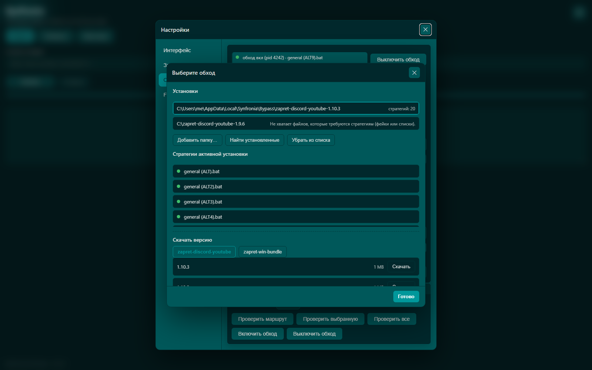
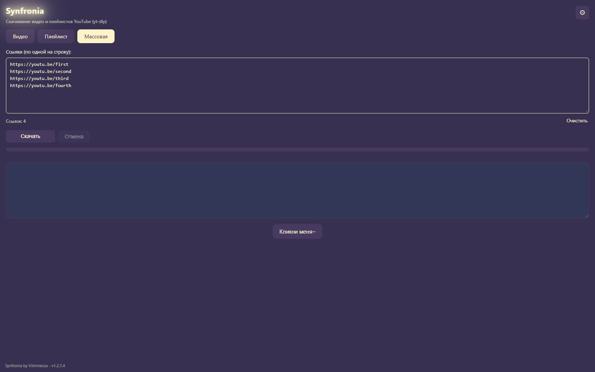
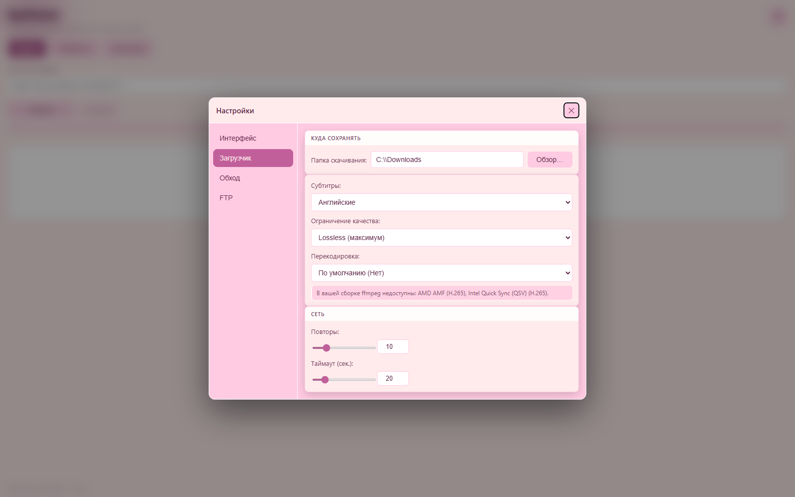
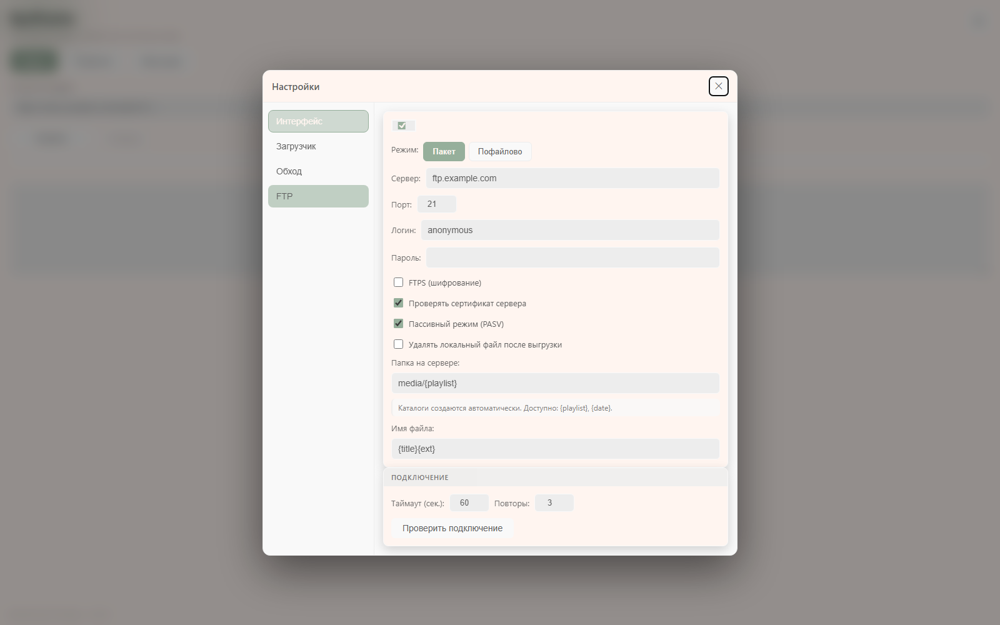

<div align="center">

# Synfronia

Download YouTube videos and playlists in one window: paste a link — get a
file with thumbnail, subtitles and metadata. Runs on Windows, **with no
accounts, telemetry or unnecessary knobs**.


English · [Русский](README.ru.md)

</div>

---

## Screenshots

| Strategy picker | Bulk download |
|---|---|
|  |  |

| Download options | FTP upload |
|---|---|
|  |  |

## Features

- **Videos and playlists** — paste a video or playlist link and press
  *Download*. A playlist can be taken whole (optionally as one folder-archive)
  or as separate files.
- **Bulk download** — paste a list of links (one per line; a pasted pile is
  split automatically): links are downloaded strictly one by one, and a
  failing one never blocks the rest. Every line gets a colored mark —
  downloaded, downloading, cancelled or queued — and failed links can be
  kept and retried with one click.
- **Finished file** — thumbnail, title and author are embedded into the
  video, subtitles (Russian, English or all) are embedded as well.
- **Quality and size** — from source quality (lossless) down to 240p;
  optional HEVC transcoding — software or hardware (NVIDIA / AMD / Intel),
  available options are detected automatically.
- **FTP/FTPS upload** — finished files can be pushed to your server
  automatically: plain FTP or FTPS, folders are created for you, path and
  file name follow templates, there is a connection test and retries.
- **If YouTube does not open** — the *Bypass* tab: *Check the route* shows
  what blocks you, *Test all* tries every strategy and marks working ones
  with **colored dots**, *Turn bypass on* raises the selected one. You can
  also let Synfronia raise the bypass before a download and drop it after.
- **Looks** — 6 built-in themes plus your own, custom interface font,
  6 interface languages (English, Russian, Japanese, Chinese, Spanish,
  German).
- **Everything stays local** — settings, logs and caches live in
  `%LOCALAPPDATA%\Synfronia`; nothing is sent anywhere.

## Installation

1. Download `Synfronia.exe` from the [releases](../../releases) page.
2. Run it — nothing to install. If ffmpeg is missing, a *Download FFmpeg*
   button appears on the first start: press it and everything sets itself up.
3. Paste a link and press *Download*.

Put `THIRD_PARTY_NOTICES.md` (component licenses) next to the exe.

Running from source and everything for developers — see
[DEVELOPING.md](DEVELOPING.md).

## How to use

### Videos and playlists

The **Video** tab takes a single video, the **Playlist** tab takes a whole
playlist. Paste a link, optionally pick quality, subtitles and transcoding
in settings (⚙ in the top right corner), then press *Download*. Files go to
`downloads\` next to the app by default (changeable in settings).

### Bulk download

The **Bulk** tab takes a list of links: one per line, `#` starts a comment,
empty lines are skipped and duplicates removed. Press *Download* (or
Ctrl+Enter) — the queue starts, every line gets a result mark, and failed
links can be kept and retried.

### If YouTube does not open

1. **Bypass** tab → **Check the route**: four checks tell whether YouTube
   opens and whether video and thumbnails come through.
2. **Test all** tries every strategy of the installed bypass: green dot —
   fully works, orange — partial, red — no. (Takes a couple of minutes and
   can be interrupted — everything already tested is kept.)
3. **Turn bypass on** — and YouTube works again. The switch at the top of
   the tab always shows whether the bypass is on right now, which strategy
   it uses and when the route was last checked.
4. The lazy option: orchestration set to **Ask** (default) offers to raise
   the bypass before a download, **Automatic** does it silently and drops
   it afterwards.

### FTP upload

The **FTP** section in settings: turn the upload on, enter host, port, login
and password, optionally FTPS and a server folder (templates like
`media/{playlist}`, nested folders are created for you). The
*Test connection* button verifies the whole login. The file is uploaded
**after** all the finishing steps (joining, subtitles, transcoding) — i.e.
as the final result. Field-by-field reference — in
[DEVELOPING.md](DEVELOPING.md#ftp).

### Themes, fonts and languages

Six built-in themes plus your own (themes folder in
`%LOCALAPPDATA%\Synfronia\themes`), your own interface font from the
`fonts` folder and six interface languages — all in settings, applied
immediately.

## Requirements

- Windows 10/11 with the WebView2 Runtime (ships with Edge by default).
- ffmpeg — downloaded automatically on the first start; manual install
  works too (PATH or winget).

## Privacy

- **No accounts, telemetry or analytics** — there is no server side at all.
- All state lives locally in `%LOCALAPPDATA%\Synfronia` and in your
  download folder.
- The network is used only for what you ask for: the download itself,
  optional font download and optional ffmpeg download.
- **Warning**: FTP credentials are stored in `settings.json` as plain text —
  do not run the app on a shared computer and do not sync that folder
  unencrypted.

## License & Disclaimer

The project is distributed under the
**[PolyForm Noncommercial License 1.0.0](LICENSE)**: use, study, modify and
share for **non-commercial purposes**; selling the product or derivative
products is prohibited. The license does not meet the OSI definition of
"Open Source" — it is **source-available** (open source with a commercial
restriction). The sources have been open since the first commit and stay
open; cloning, forking and pull requests are welcome, and every release is
published with sources and build provenance.

Please respect the [YouTube Terms](https://www.youtube.com/static?template=terms)
and copyrights: download only content you are allowed to keep, and do not
redistribute files without the rights holder's permission. Synfronia is
**not affiliated with, endorsed by or sponsored by** YouTube, Google or any
other mentioned brand.

The software is provided **"as is", without warranties**; the author is not
liable for misuse. By using Synfronia you accept the PolyForm Noncommercial
License 1.0.0.

**About the code**: this is a vibe-coded project — written and evolved with
the help of an AI model (LLM-assisted development), and that is an honest,
deliberate style. "As is" also means "the AI can be wrong": if you found a
bug — an issue or pull request is worth more than ever.

Verify that the downloaded exe was built from these sources (SLSA provenance
is attached to every release):

```bash
gh release download -R vilminessa/Synfronia -p Synfronia.exe -p Synfronia.exe.intoto.jsonl
gh attestation verify Synfronia.exe --bundle Synfronia.exe.intoto.jsonl \
  -R vilminessa/Synfronia \
  --predicate-type https://slsa.dev/provenance/v0.2 \
  --signer-repo slsa-framework/slsa-github-generator
```

---

© 2026 [vilminessa](https://github.com/vilminessa) · PolyForm Noncommercial 1.0.0
